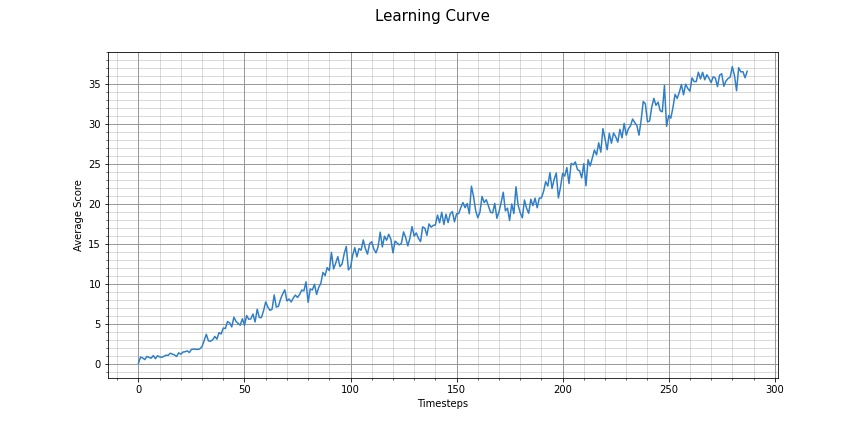

# Deep Reinforcement Learning : Project 2: Continuous Control Report

## Author : Nishi Sood
This document presents a technical description of the Continuous Control project in the context of the Deep Reinforcement Learning Nanodegree from Udacity.

## Summary of environment and task
This project trains a Reinforcement Learning agent to solve a variant of the [Reacher Environment](https://github.com/Unity-Technologies/ml-agents/blob/master/docs/Learning-Environment-Examples.md#reacher) agent by Unity.

## Project's Environment details
 - The environment is based on Unity ML-agents. The project environment provided by Udacity is similar to the Reacher environment on the Unity ML-Agents GitHub page.
 - Set-up: Double-jointed arm which can move to target locations.
 - Goal: The agents must move its hand to the goal location, and keep it there.
 - Agents: The environment contains 20 agents linked to a single Brain.
     - The provided Udacity agent versions are Single Agent or 20-Agents
   - Agent Reward Function (independent):
     - `+0.1` Each step agent's hand is in goal location.
 - Brains: One Brain with the following observation/action space.
 - Vector Observation space: 26 variables corresponding to position, rotation, velocity, and angular velocities of the two arm Rigid bodies.
 - Vector Action space: (Continuous) Size of 4, corresponding to torque applicable to two joints.
   - Visual Observations: None.
   - Reset Parameters: Two, corresponding to goal size, and goal movement speed.
   - The task is episodic, with 1000 timesteps per episode. In order to solve the environment, the agent must get an average score of +30 over 100 consecutive episodes.
   - Benchmark Mean Reward: 30

## About Deep Reinforcement Learning Terminologies

### Reinforcement learning:
- refers to goal-oriented algorithms, which learn how to attain a complex objective (goal) or maximize along a dimension over many steps; for example, maximize the points won in a game over many moves. 
- They can start from a blank slate, and under the right conditions they achieve superhuman performance.
- Like a child incentivized by spankings and candy, these algorithms are penalized when they make the wrong decisions and rewarded when they make the right ones – this is reinforcement.

### Methods Used:

### Policy-based & value-based methods
- With value-based methods, the agent uses its experience with the environment to maintain an estimate of the optimal action-value function. The optimal policy is then obtained from the optimal action-value function estimate.
- Policy-based methods directly learn the optimal policy, without having to maintain a separate value function estimate.
- One of the limitations of value-based methods is that they tend to a deterministic or near deterministic policies.
- On the other hand, policy-based methods can learn either stochastic or deterministic policies, so that they can be used to solve environments with either finite or continuous action spaces.

### Actor-critic methods
 - In actor-critic methods, we are using value-based techniques to further reduce the variance of policy-based methods.
 - Basically actor-critic are a hybrid version of the policy- and value- based methods, in which the actor estimates the policy and the critic estimates the value function.
 
### Deep Deterministic Policy Gradient (DDPG)
 - Deep Deterministic Policy Gradient (DDPG) is an algorithm which concurrently learns a Q-function and a policy. 
 - It uses off-policy data and the Bellman equation to learn the Q-function, and uses the Q-function to learn the policy.
 - The original DQN works in discrete space, and DDPG extends it to continuous space with the actor-critic framework while learning a deterministic policy.
 - In DDPG, we use 2 deep neural networks : one is the actor and the other is the critic:
 
More details available on the Open AI's Spinning Up(https://spinningup.openai.com/en/latest/algorithms/ddpg.html) website.

### Replay Buffer
 - In Reinforcement Learning, samples are generated from exploring sequentially in an environment, resulting in the previous assumption that no longer holds.
 - DDPG is an off-policy algorithm, that is it employs a separate behavior policy independent of the policy being improved

## Code implementation Details

The code used here is derived from the "DDPG bipedal" tutorial from the Deep Reinforcement Learning Nanodegree, and has been slightly modified to handle multiple simultaneous agents in the same environment.
The code is written in Python 3.6 and is using PyTorch 0.4.0 framework.
The code consists of :
 - `Continuous_Control_EnvExploration.ipynb`:  Notebook used to verify the Environment Setup and initial working of Unity Agent
 - `Continuous_Control_Solution.ipynb`: Notebook used to control and train the final version of the agent
 - `ddpg_agent.py`: Create an Agent class that interacts with and learns from the environment
 - `model.py`: Actor and Critic classes
 - `checkpoint_actor.pth` : saved model for the actor
 - `checkpoint_critic.pth` : saved model for the critic
 - `learning_curves.jpg` : Learning Curve Displaying the trained agent
 - `Project2_Report.pdf`: The submission includes a file in the root of the GitHub repository that provides a technical description of the implementation.
 - `README.md` : The README describes the project environment details (i.e., the state and action spaces, and when the environment is considered solved). It has instructions for installing dependencies or downloading needed files and process to run the code in the repository, to train the agent.
 
 
###  The Actor Neural Networks use the following architecture :
#### ACTOR NETWORK
`
Input nodes (33) 
  -> Fully Connected Layer (256 nodes, Relu activation) 
    -> Batch Normlization
      -> Fully Connected Layer (128 nodes, Relu activation) 
         -> Ouput nodes (4 nodes, tanh activation)
         `

### The Critic Neural Networks use the following architecture :
#### CRITIC NETWORK
`
Input nodes (33) 
  -> Fully Connected Layer (128 nodes, Relu activation) 
    -> Batch Normlization
      -> Include Actions at the second fully connected layer
        -> Fully Connected Layer (256+33 nodes, Relu activation) 
          -> Fully Connected Layer (2128 nodes, Relu activation)
           -> Ouput node (1 node, no activation)
           `
          
Training of the agent was performed on the `Continuous_Control_Solution.ipynb` notebook.

## Training

Training of the agent was performed on the Continuous_Control_Solution.ipynb notebook.
 - Run the cells in order in the notebook Continuous_Control_Solution.ipynb to train an agent that solves our required task of moving the double-jointed arm.
 - They will initialize the environment and train until it reaches the goal condition of +30
 - The agent is trained until it solves the environment, that is to say an average reward of at least +30 for the last 100 episodes.
 - A graph of the scores during training will be displayed after training.

## Results

The agent was able to solve the environment in 150 episodes with an average Score: 30.11. Below is the learning curve.

Environment solved in 150 episodes!	Average Score: 30.11

## Ideas for future work
- We could have used different Optimization algorithm to check the difference in the Agent trained and its performance.
- There could be better results by making use of prioritized experience replay with the existing learning algorithm.
- Distributed Distributional Deterministic Policy Gradients - D4PG looks very interesting has achieved state of the art results on continuous control problems
 - Also, PPO, A3C can be used in multi agent training environment.
- It would be interesting to see how the agent performs on this environment in future implementations.
- In future implementations,  I can try testing the agent with difference hyperparameter values, like different Sigma values, faster and smaller learning rates, tweaking the neural network, to choose the final model
- Open AI's blog post Better Exploration with Parameter Noise

